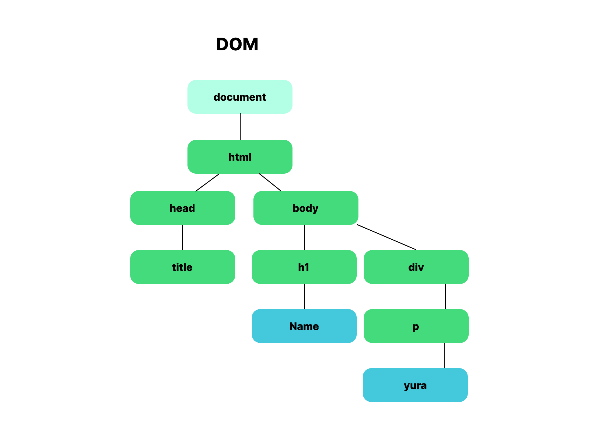

## DOM과 Virtual DOM

DOM은 HTML, XML 문서의 프로그래밍 인터페이스이다. 문서의 구조화된 표현을 제공해 개발자가 문서 구조, 스타일, 내용 등을 변경할 수 있게 돕는다. 하지만 DOM은 값이 수정되면 브라우저의 렌더링 과정이 모두 다시 실행되어 비효율적이다. 최근에는 SPA(Single Page Application)의 사용이 증가하면서 DOM tree를 즉각적으로 자주 변경해야 했다. 따라서 브라우저 단에서 JS가 관리하여 DOM 조작을 효율적으로 처리하도록 하는 최적화가 필요하게 되었고, 이에 따라 Virtual DOM이 등장하게 되었다.

> #
>
> ### DOM (The Document Object Model)
>
> #### 개념
>
> - HTML요소를 JavaScript Object처럼 조작할 수 있는 Model이다.
> - HTML로 구성된 웹페이지를 동적으로 움직이게 만들 수 있다.
>
> #### 구조
>
> - 트리 구조 (DOM tree)
>   - body가 가장 상위에 있으며 구성요소가 '부모-자식' 관계로 이루어져있다.
> - 트리는 네 종류의 node로 구성된다.
>   - 문서 노드 Document node
>   - 요소 노드 Element node
>   - 어트리뷰트 노드 Attribute node
>   - 텍스트 노드 Text node
>     
>
> #### 브라우저의 동작 방식
>
> 1. DOM tree 생성  
>    - &nbsp; &nbsp; 렌더 엔진이 HTML을 파싱하여 DOM 노드로 이루어진 트리를 생성한다.
> 2. Render tree 생성  
>    - &nbsp; &nbsp;CSS파일과 inline 스타일을 파싱한다.
>    - &nbsp; &nbsp;DOM과 CSSOM 을 결합해 렌더 트리를 생성한다.  
> 3. Layout (reflow) 단계  
>    - &nbsp; &nbsp; 각 노드의 스크린에서의 위치와 크기를 결정한다.
>    - &nbsp; &nbsp; 예) position, size 등이 결정됨
> 4. Paint(repaint)  
>    - &nbsp; &nbsp; 실제 화면에 그리는 단계
>    - &nbsp; &nbsp; 유저가 보는 브러우저 상의 UI가 나타난다.
>
> ###### 문서 파싱: 브라우저가 코드를 이해하고 사용할 수 있는 구조로 변환하는 것
>
> ###### CSSOM: CSS Object Model, CSS 스타일의 구조를 나타낸다.
>
> #

> #
>
> ### Virtual DOM
>
> #### 개념
>
> - UI의 가상적인 표현을 메모리에 저장하고 React DOM과 같은 라이브러리에 의해 실제 DOM과 동기화하는 프로그램
> - HTML DOM의 추상화 버전
>   - 제 DOM의 속성들을 가지고 있지만, 실제 DOM의 API는 가지고 있지 않다.
>   - 데이터가 변경되면 전체 UI는 virtual dom에 렌더링된다.
>   - 이전 버츄얼 돔과 업데이트 내용을 비교해 변경된 부분만 실제 돔에 적용한다.
>
> #### 장점 (왜 사용할까?)
>
> - 비용 최소화 및 일관성 확보
>   - Virtual DOM은 실제 DOM이 아닌 메모리 상에서 동작하기 때문에 연산 비용이 최소화된다. 실제 DOM을 조작하지 않고 필요한 UI의 업데이트만 적용이 가능하다. 실제로 30개의 요소가 변화해도 레이아웃이 30번 실행되지 않고, 모든 변화를 하나로 묶어 한 번만 실행하기 때문에 실제 DOM에 비해 효율적이다.
> - 복잡한 UI 관리
>   - 비교적 규모가 큰 서비스에서는 UI를 관리하기 위해 컴포넌트 기반 아키텍처를 사용한다. 가상 DOM은 이를 효율적으로 관리할 수 있게 해준다.
>
> #### 단점
>
> - 추가 메모리 사용
>   - Virtual DOM은 메모리 상에 DOM과 동일한 구조의 메모리를 유지하기 때문에 추가적인 메모리가 소모된다.
> - 복잡성 증가
>   - 뷰(View)와 상태(State)를 동기화하기 위해 추상화 계층을 사용한다. 이로 인해 애플리케이션의 복잡성이 증가할 수 있다.
>
> #

## MPA와 SPA

### 개념 배경

전통적으로 웹 브라우저는 MPA 방식을 따랐다. 서버를 호출할 때마다 새 HTML 페이지를 응답받는 해당 방식은 새로운 페이지를 서버에 요청할 때마다 정적 리소스가 다운로드 되고 그에 맞춰 전체 페이지를 리렌더링하는 방식으로 작동됐다.   하지만 이렇게 불필요한 리로딩을 하는 과정에서 화면 깜빡임 이슈와 서버 부하가 발생한다. 따라서 서비스 규모가 커질 수록 사용자 경험 저하와 성능 이슈가 발생할 수 있다는 우려가 나타났고, 이에 따라 SPA 방식이 새로이 등장했다. SPA는 단일 페이지 애플리케이션으로서 AJAX 및 HTML5를 사용해 새로고침 없이 반응이 빠른 웹앱을 만들 수 있다.

###### 정적리소스: _서버에 존재하는 파일_ 인 HTML, CSS, JS,이미지, 영상 등을 일컫는다.

> #
>
> ### MPA (Multi Page Application)
>
> #### 개념
>
> - 웹 앱을 개발하는 전통적인 방식
> - **두 개 이상(Multiple)** 의 페이지로 구성된 애플리케이션
>
> #### 작동 방식
>
> - **인터렉션이 발생하면 앱을 새로고침**하며 서버에서 렌더링된 정적 리소스가 다운로드된다.  
> - 페이지를 이동하거나 새로고침하면 전체 페이지를 리렌더링한다.
> - MPA는 SSR(Server Side Rendering) 방식으로 렌더링한다.
>
> #### 장점
>
> - SEO(Search Engine Optimization) 친화적   &nbsp; &nbsp; 여러 페이지를 생성할 수 있기 때문에 많은 수의 키워드를 타겟팅할 수 있어 트래픽 양이 자동적으로 향상된다.
>
> #### 단점
>
> - 페이지 이동 시 속도 저하   &nbsp; &nbsp;유저가 페이지를 이동하면 전체 페이지를 리렌더링하기 때문에 속도에 영향을 받는다.
>
> #

> #
>
> ### SPA (Single Page Application)  
>
> - 현대적인 방식
> - **하나의 페이지만(Single)** 가지는 웹 애플리케이션
> - 페이지를 변경하지 않고 동일한 페이지 내에서
> - 핵심가치: 사용자 경험 (UX) 향상 및 애플리케이션 속도 향상
> - 예시 서비스: Gmail, Google Maps, Facebook
>
> #### 작동 방식
>
> - 필요한 모든 정적 리소스를 최초 접근 시 한 번만 다운로드한다.  
> - 이벤트 발생 시 **페이지 갱신에 필요한 데이터만** 전달받아 페이지를 렌더링한다.
> - 보통 SPA는 CSR(Client Side Rendering) 방식으로 렌더링한다.
>
> ##### 예시 JS 기반 프레임워크: React, Vue 등
>
> #### 장점
>
> - 속도 향상   &nbsp; &nbsp; 필요한 부분만 렌더링하는 방식을 통해 속도 향상되며, 이는 곧 사용자 경험을 향상한다.
> - 모바일 친화적   &nbsp; &nbsp;모바일 앱 역시 SPA와 동일한 아키텍처로 개발되기 때문에 모바일 개발을 고려하면 백엔드 코드의 재사용성이 높아진다.
> - 로컬 스토리지 캐시   &nbsp; &nbsp; SPA는 로컬 스토리지를 활용해 데이터를 저장할 수 있다. 애플리케이션은 하나의 요청만 보내고 모든 데이터를 저장하기 때문에 다음 요청에서도 이 데이터를 사용 가능하다.  
>
> ##### &nbsp; &nbsp; 캐시: 데이터를 임시로 저장해 두는 공간.
>
> #### 단점
>
> - 초기 구동 속도  &nbsp; &nbsp; 최초 접근 시 모든 정적 리소스를 다운로드하기 때문에 초기 구동 속도가 상대적으로 느리다.
> - SEO 이슈  &nbsp; &nbsp; SPA는 JS로 구축되기 때문에, JS를 읽지 못하는 검색엔진에서는 크롤링이 되지 않아 색인이 되지 않는 문제가 발생할 수 있다.
>
> #

## CSR과 SSR

두 방식은 렌더링을 **어디서** 하는지에 따라 차이가 있다. 렌더링 방식은 웹 페이지의 반응 속도에 영향을 미치고 사용자 경험까지 영향을 주기 때문에 중요하다. CSR과 SSR은 서로 상반된 방식으로 작동하는 만큼 장단점이 서로 엇갈려 있다. 따라서 이 두 가지 방식의 장단점을 이해한 채로 적재적소에 필요한 방식으로 구현하는 것이 중요하다.

##### 렌더링: 웹에서 렌더링은 개발자가 작성한 코드를 브라우저를 통해 사용자가 상호작용할 수 있는 인터페이스를 나타내는 과정이다.

> #
>
> ### CSR (Client Side Rendering)
>
> #### 개념
>
> - 클라이언트 측에서 렌더링하는 방식
> - 사용자가 웹 사이트에 접속하면 서버는 실제 웹페이지의 콘텐츠가 아니라 그 콘텐츠가 렌더링 될 껍데기를 내보낸다. CSR에서는 껍데기만 렌더링한 뒤, JS를 활용해 동적으로 콘텐츠를 채우는 방식으로 렌더링한다.
>
> #### 작동 방식
>
> - 사용자가 웹에 방문하면 브라우저가 서버에 콘텐츠를 요청한다.
> - 서버는 빈 뼈대 HTML을 응답으로 회신한다.
> - 브라우저가 연결된 JS 링크를 통해 서버로부터 JS 파일을 다운로드한다.
> - JS를 통해 동적으로 페이지를 만들고 이를 브라우저에 출력한다.
>
> #### 장점
>
> - 향상된 유저 경험   &nbsp; &nbsp; 화면이 깜빡이지 않고 수정된 부분만 표시된다. 페이지를 리렌더링할 때 필요한 데이터만 리렌더링하기 때문에 구동 속도가 빠르다. 또한 연산, 라우팅 등의 작업은 클라이언트 단에서 처리하기 때문에 속도 향상에 도움된다.
> - 서버 부담 감소   &nbsp; &nbsp; 서버는 빈 뼈대 HTML만 넘기기 때문에 부하가 적다.
>
> #### 단점
>
> - SEO 최적화 불리   &nbsp; &nbsp; 첫 페이지 로딩 시 빈 뼈대 HTML만 서버로부터 받기 때문에 파일이 비어 있어 크롤링 봇은 색인할만한 콘텐츠가 존재하지 않는다고 인식한다.
> - 보안 이슈   &nbsp; &nbsp; 쿠키나 로컬스토리지에 저장되는 사용자 정보의 도용에 취약하며, 핵심 기능이 클라이언트 단에서 수행되기 때문에 로직이 노출될 가능성이 있다.
>
> #

> #
>
> ### SSR (Server Side Rendering)
>
> #### 개념
>
> - 서버 측에서 렌더링하는 방식
> - 사용자가 웹 사이트에 접속하면 서버가 웹 페이지의 모든 콘텐츠를 포함한 HTML 문서를 내보낸다.
>
> #### 작동 방식
>
> - 사용자가 웹 사이트에 방문하면 브라우저가 서버에 콘텐츠를 요청한다.
> - 서버는 페이지에 필요한 데이터를 얻어 CSS까지 적용하여 HTML과 JS 코드를 응답으로 보낸다.
> - 브라우저에서는 JS 코드를 다운로드하고 HTML에 JS 로직을 연결한다.
>
> #### 장점
>
> - SEO에 유리   > &nbsp; &nbsp; 서버 단에서 모든 데이터가 이미 HTML에 담긴 채로 브라우저에 응답하기 때문에 검색에 유리하다.
> - 빠른 FCP (First Contentful Paint)   &nbsp; &nbsp; JS 코드를 다운받고 실행하기 전에 사용자는 이미 HTML이 렌더링된 화면을 볼 수 있다. 이는 곧 FCP (First Contentful Paint)가 CSR보다 빠르다는 의미이다. 하지만 주의할 점은 이 시점부터 웹 페이지와의 상호작용이 가능하다는 뜻은 아니라는 점이다. 이 시점에서는 사용자가 빈 화면을 보는 게 아닐 뿐이고, JS Bundle이 모두 로드되기 전까지는 상호작용은 불가능하다.
>
> #### 단점
>
> - TBT(Total Blocking Time)가 생긴다.   &nbsp; &nbsp; TTV와 TTI의 시간차가 존재한다. SSR은 빠른 FCP를 자랑하지만, 이는 상호작용이 가능한 페이지처럼 보일 뿐이고, 실제로는 JS로직이 모두 연결될 때까지는 사용자 입력에 응답할 수 없다. 이는 곧 TTV와 TTI 간에 시간차가 존재한다는 의미이다.
>
> ##### &nbsp; &nbsp; TTV : Time To View
>
> ##### &nbsp; &nbsp; TTI : Time To Interact
>
> #

> #
>
> ### 결론 : Content 중심의 개발이 중요하다.
>
> 1. 단순한 정보를 나타낼 경우 **(SSR)서버 사이드 렌더링**이 적합하다.
> 2. 동적인 부분을 나타낼 경우 **(CSR)클라이언트 사이드 렌더링**이 적합하다.
>
> #

[참고자료]

- 기본 자료

1. 브라우저는 어떻게 동작하는가? -
   https://d2.naver.com/helloworld/59361

2. DOM과 Virtual Dom이란?  
   https://www.howdy-mj.me/dom/what-is-dom
   https://www.youtube.com/watch?v=6rDBqVHSbgM

3. CSR / SSR (+ SPA / MPA)  
   https://bangsj1224.tistory.com/108#CSR
   https://www.youtube.com/watch?v=TXzwuaXQN2U

- 추가 자료

1. DOM
   https://www.youtube.com/watch?v=PN_WmsgbQCo
   https://developer.mozilla.org/ko/docs/Web/API/Document_Object_Model/Introduction

2. SPA & MPA
   https://youtu.be/vM_zQLnlyKw?si=B1YokQjL65DP-sj7
   https://velog.io/@yejine2/SPASingle-Page-Application-VS-MPA

3. CSR/SSR
   https://homeless-programmer.tistory.com/5
   https://omins.tistory.com/92

